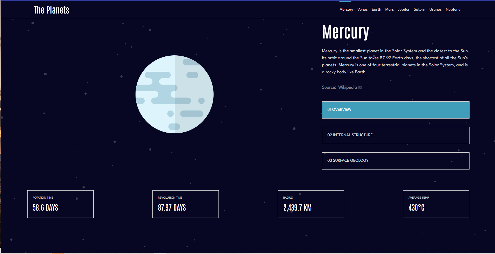
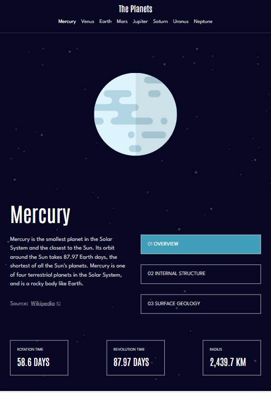
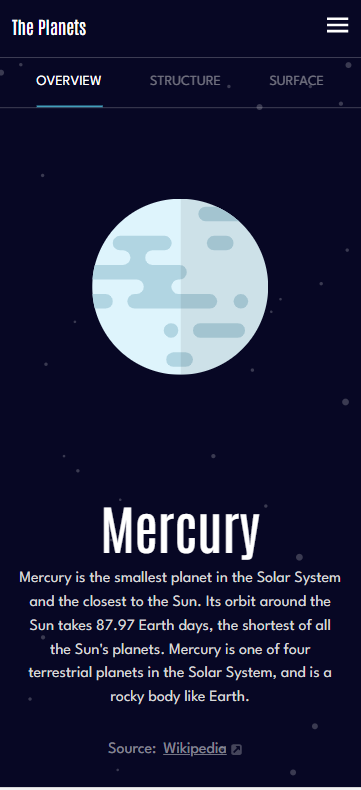
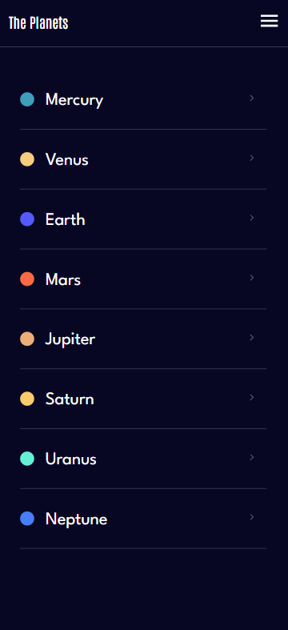

# Frontend Mentor - Planets fact site solution

This is a solution to the [Planets fact site challenge on Frontend Mentor](https://www.frontendmentor.io/challenges/planets-fact-site-gazqN8w_f). Frontend Mentor challenges help you improve your coding skills by building realistic projects. 

## Table of contents

- [Overview](#overview)
  - [The challenge](#the-challenge)
  - [Screenshot](#screenshot)
  - [Links](#links)
- [My process](#my-process)
  - [Built with](#built-with)
  - [What I learned](#what-i-learned)
  - [Continued development](#continued-development)
- [Author](#author)

## Overview

### The challenge

Users should be able to:

- View the optimal layout for the app depending on their device's screen size
- See hover states for all interactive elements on the page
- View each planet page and toggle between "Overview", "Internal Structure", and "Surface Geology"

### Screenshot

### Links

- Solution URL: [Add solution URL here](https://your-solution-url.com)
- Live Site URL: [Add live site URL here](https://your-live-site-url.com)

## My process
- Implemented the project with React.js, Tailwind css and CSS3. my approach for this project was to break down the project into smaller manageable junks and generalizing my components so they can be reusable. 

### Built with

- Semantic HTML5 markup
- CSS custom properties
- Flexbox
- Responsive Design
- Tailwind CSS
- [React](https://reactjs.org/) - JS library

### What I learned

I learned how to make my component reusable to the point where I can use one component for all planets. In addition to that I learned 

### Continued development

I will focus more on how to create beautiful layouts using CSS and Tailwind to the point where I can implement beautiful design faster and more effeciently

## Author

- Website - [Omar Ismail](https://omarismail7980.github.io/Portfolio/)
- Frontend Mentor - [@OmarIsmail7980](https://www.frontendmentor.io/profile/OmarIsmail7980)

